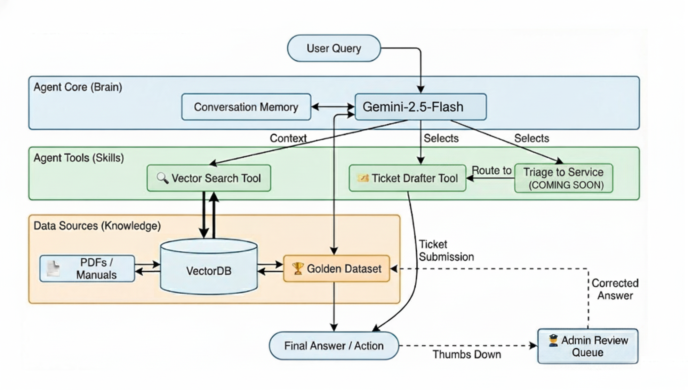

# Service Desk AI 🎓

An agentic RAG (Retrieval-Augmented Generation) assistant designed to help staff and students navigate Macquarie University policies. Built with **LangChain**, **Flask**, and **Google Gemini**, it provides accurate, sourced answers with transparent reasoning.

## ✨ Features

*   **📚 Specialized Knowledge Base** - Indexes and retrieves from official PDF policy documents.
*   **🧠 Agentic Reasoning** - Uses a ReAct loop (Thought, Action, Observation) to break down complex queries.
*   **⚡ Real-time Streaming** - Displays the agent's "thought process" and final response in real-time.
*   **📊 Admin Dashboard**
    *   **Analytics** - Track query volume, sentiment, and response times.
    *   **Feedback Loop** - Review user feedback and "ingest" corrected answers into a Golden Dataset.
    *   **Evaluation** - Built-in RAGAS evaluation tab to assess Faithfulness, Answer Relevancy, and Context Precision.
*   **🧪 Synthetic Data Generation** - Automatically generates test cases from your data for evaluation.

## 🏗️ Architecture



## 🛠️ Tech Stack

*   **LLM** - Google Gemini (via `langchain-google-genai`)
*   **Vector Store** - FAISS
*   **Backend** - Flask (Python)
*   **Frontend** - Vanilla JS, HTML5, CSS3
*   **Evaluation** - RAGAS (RAG Assessment)

## 🚀 Getting Started

### Prerequisites

*   Python 3.10+
*   Google Cloud API Key (with Gemini access)

### Installation

1.  **Clone the repository**
    ```bash
    git clone https://github.com/Lorenzo01/ServiceDeskAgent.git
    cd ServiceDeskAgent
    ```

2.  **Install dependencies**
    ```bash
    pip install -r requirements.txt
    ```

3.  **Configure Environment**
    Create a `.env` file in the root directory
    ```env
    GOOGLE_API_KEY=your_api_key_here
    FLASK_SECRET_KEY=your_secret_key
    ```

4.  **Ingest Data**
    Place your PDF documents in the `data/` directory and run
    ```bash
    python ingest_data.py
    ```

5.  **Generate Evaluation Data (Optional)**
    Create a synthetic test set for RAGAS evaluation
    ```bash
    python generate_synthetic_data.py
    ```

6.  **Run the Application**
    ```bash
    python app.py
    ```
    Access the chat interface at `http://localhost:8090`.
    Access the admin panel at `http://localhost:8090/admin`.

## 📈 Evaluation

The project includes a dedicated **Evaluation Tab** in the admin panel.
1.  Navigate to `/admin/evaluation`.
2.  Click **Run Evaluation**.
3.  The system will run a subset of the synthetic dataset through the RAG pipeline and evaluate the results using RAGAS metrics
    *   **Faithfulness** - Is the answer derived from the context?
    *   **Answer Relevancy** - Is the answer relevant to the question?
    *   **Context Precision** - Was the relevant context retrieved?

## 📂 Project Structure

```
├── data/                   # PDF source documents
├── faiss_index/            # Vector store index
├── static/                 # CSS, JS, Images
├── templates/              # HTML templates
├── admin_routes.py         # Admin dashboard logic
├── app.py                  # Main Flask application
├── ingest_data.py          # Data ingestion script
├── service_desk_bot.py     # Core RAG agent logic
└── requirements.txt        # Python dependencies
```

## ⚠️ Disclaimer

This project is not affiliated with, endorsed by, or employed by Macquarie University. The policy documents used in this system were taken from the Macquarie University Policy Portal for demonstration and decision-point simulation purposes only.If you have any questions please contact policies@mq.edu.au directly.

 
